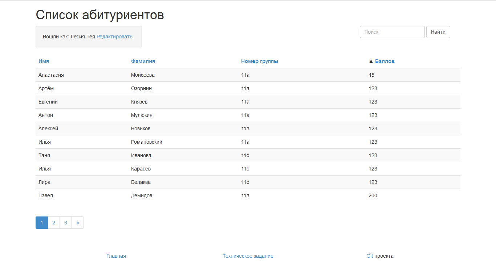
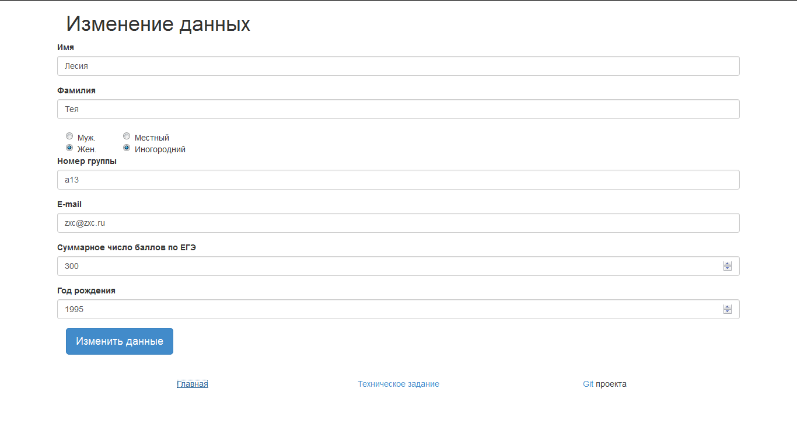
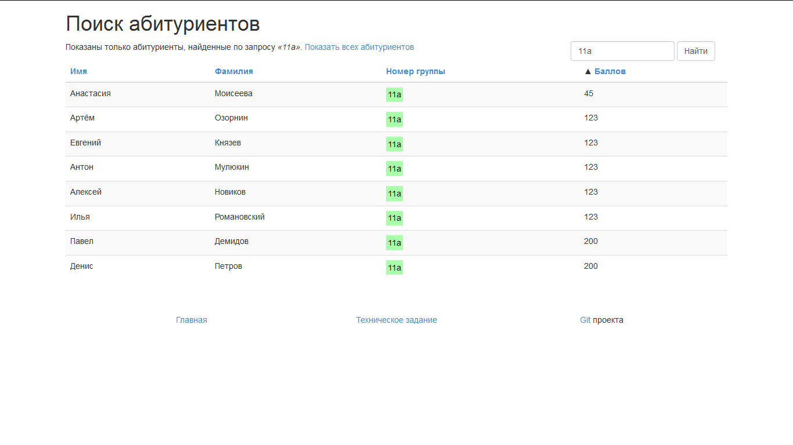

# Программа StudentList

## Используемые технологии
ООП, MVC, Twitter Bootstrap, Depency Injection, PDO (MySQL), JSON, паттерн TableDataGateway, Composer Autoload, контейнер (Pimple), Git

## Как установить
Внимание! пример конфига Apache: файл `httpd.conf` в корне проекта

- Скопировать проект в web-директорию
- Импортировать таблицу в БД из дамп-файла `students.sql`
- Отредактировать `config.json` (значение projectFolder либо `/path/to/public`
либо `/`
, если вы установили `students/public` корнем веб-сервера) 
- Установить [composer](https://getcomposer.org/)
- Выполнить `composer install`

## Скриншоты программы

